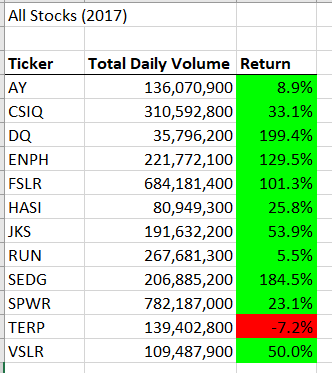
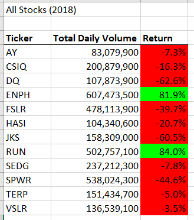
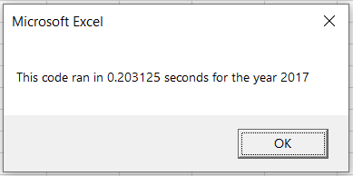
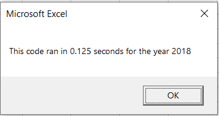
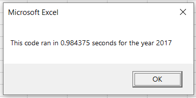
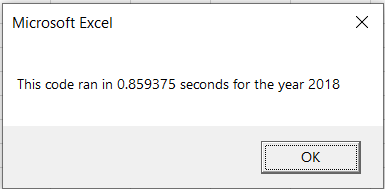

# stock-analysis
To Analyze thousands stock performance for 2017 and 2018

## Overview of Project:

#### Background

Steve wants to do some research for his parents to pick some stocks. He wants to include the entire stock market over the last few years. 

#### Purpose

We will use VBA to loop through all the 12 stocks data in 2017 and 2018 to find out the total trading volumes of the stocks and the return of the stocks.  Then Steve's parents would be able to pick the better stocks based on the trading volumes and the returns.

## Result:

#### Stock Performance

The stock performance in 2017 is much better than 2018, shown by the following tables.  11 out of 12 stocks have positive returns, including stocks DQ, ENPH, FSLR and SEDG have over 100% returns.  In 2018, only 2 out of 12 stocks have positive returns.

    

#### VBA Code Performance

The code performance is measured by the running time of the code.  The challenge refactored code running times for 2017 and 2018 stock data are 0.203125 s and 0.125 s, respectively.  These times are much faster than the original running times of 0.984375 s and 0.859375 s. 

                

  		2017 Refactored code                                      2018 Refactored code

        

		2017 Original code                                        2018 Original code

### Summary:

Refactoring is not making new functionalities, but rather to make the code more efficient by taking fewer steps, using less memory, or improving the logic of the code to make it easier for future users to read.  The advantages of refactoring is that the code is more efficient.  The disadvantages of refactoring is that the person who is doing the refactoring must fully understand the  costumer requirements, data structures, and the code logics to have a balance between the efficiency and the maintainability.  Sometimes, it is not easy to meet all the requirements.

For this specific stock analysis problem, the pro of the refactored code is that it runs faster, almost 4 time faster than the original code.  The con of the refactored code is that it is highly depended on the data structure, i.e. the data must be well sorted.  otherwise the code won't work.
